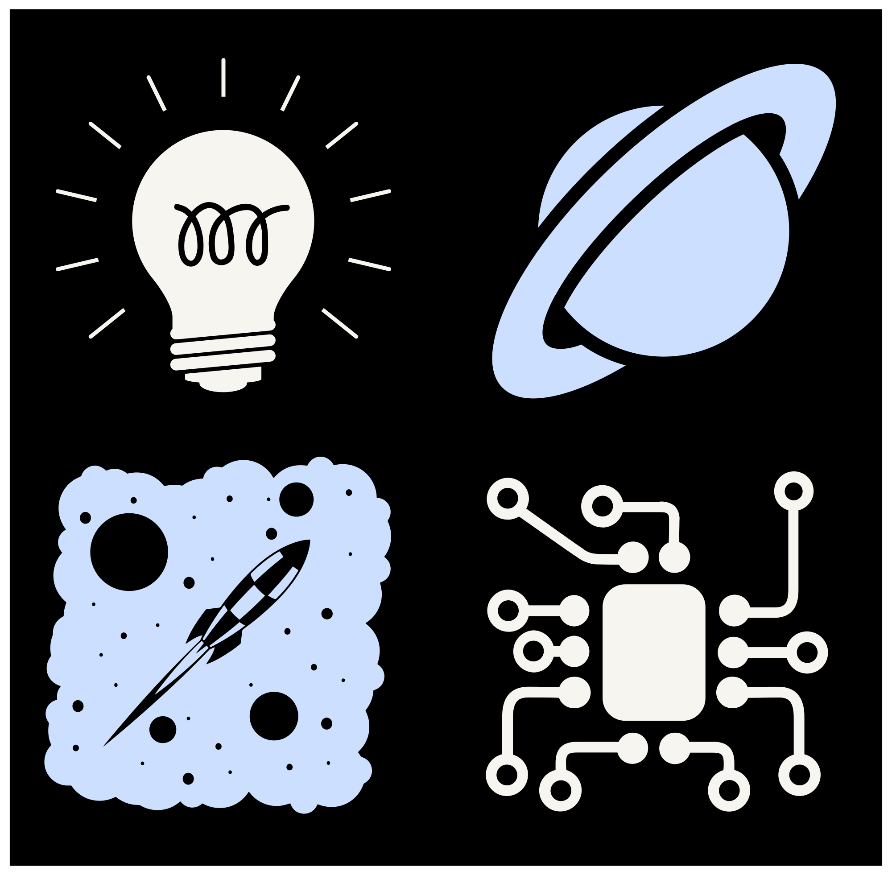

<!-- HERO -->

  <!-- Optional banner -->
  

  <h1 style="margin: 18px 0 6px 0;">Yash — AI Engineer · Founder @ Xarch</h1>

  

    Building dependable systems across AI, web, and on‑device inference. Minimalist craft, production rigor.
  

  <!-- Primary links -->
  

    <a href="https://xarch.in">xarch.in</a> ·
    <a href="https://github.com/YOUR_USERNAME">GitHub</a> ·
    <a href="https://linkedin.com/in/YOUR_LINK">LinkedIn</a> ·
    <a href="mailto:YOUR_EMAIL">Email</a>
  

  <!-- Live stats (lightweight, tasteful) -->
  

    
    
  

