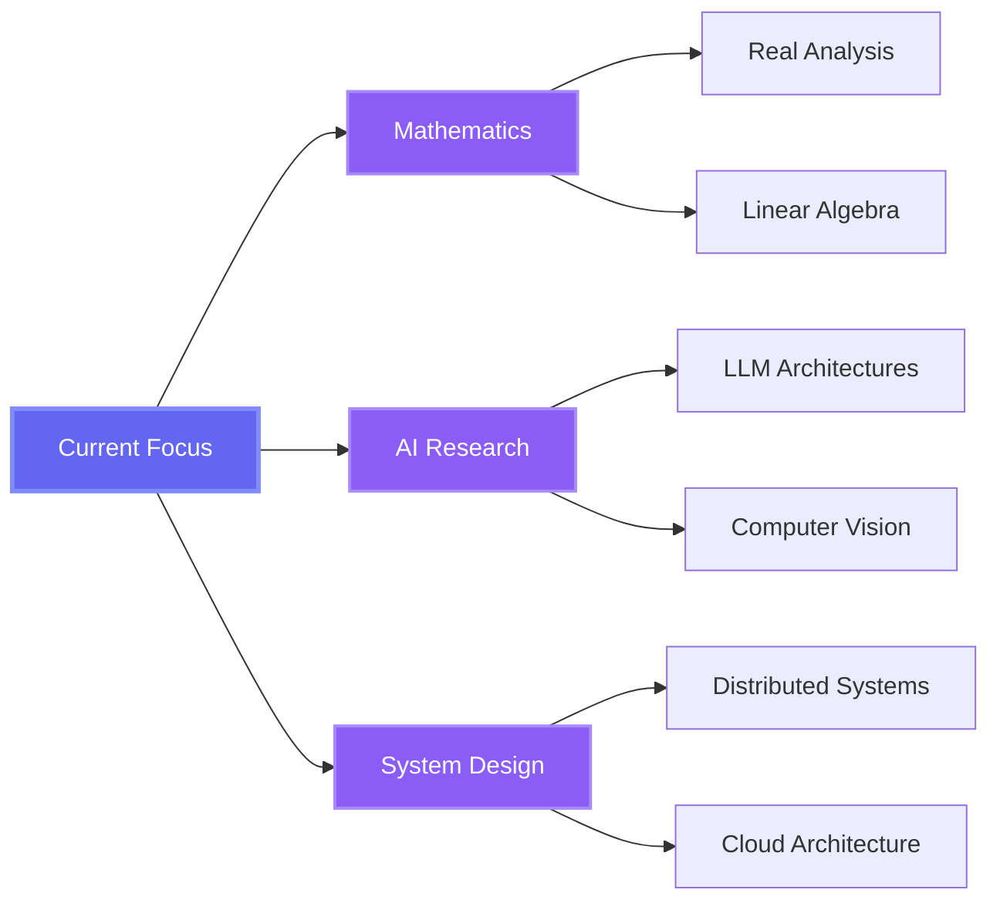

<div align="center">

<!-- ANIMATED HEADER -->


<br/>

<!-- TYPING ANIMATION -->
<a href="https://git.io/typing-svg">
  
</a>

<br/><br/>

<!-- SOCIAL BADGES WITH HOVER EFFECT -->
<p align="center">
  <a href="https://xarchlabs.com">
    
  </a>
  <a href="https://linkedin.com/in/YOUR_LINKEDIN">
    
  </a>
  <a href="https://github.com/firecodespace">
    
  </a>
  <a href="mailto:YOUR_EMAIL@example.com">
    
  </a>
</p>

<br/>

<!-- PROFILE VIEWS COUNTER -->


</div>

<br/><br/>

---

<br/>

<!-- ABOUT SECTION WITH GRADIENT -->
<div align="center">

##  **ABOUT ME**

</div>

<br/>

```typescript
const yash = {
    role: "AI Engineer & Founder @ Xarch Labs",
    location: "Building the Future 🚀",
    code: ["TypeScript", "Python", "C++", "JavaScript"],
    focus: ["Artificial Intelligence", "Full-Stack Development", "System Architecture"],
    passion: "Transforming ideas into intelligent, scalable solutions",
    currentMission: "Building Nexus AI - Next-gen AI SaaS platform",
    philosophy: "Ship fast, iterate faster, impact always"
};
```

<br/>

<!-- CURRENT FOCUS -->
<div align="center">

### 🎯 **CURRENT FOCUS**

<table>
<tr>
<td align="center" width="33%">

**🧠 NEXUS AI**  
Multi-tenant AI SaaS with  
adapter-based fine-tuning

</td>
<td align="center" width="33%">

**🤖 LLM ADAPTERS**  
Building personalized  
on-device AI assistants

</td>
<td align="center" width="33%">

**📊 CONTENT SYSTEMS**  
Robust platforms with  
Supabase & Vercel

</td>
</tr>
</table>

</div>

<br/><br/>

---

<br/>

<!-- TECH STACK SECTION -->
<div align="center">

## ⚡ **TECH ARSENAL**

<br/>

### **Languages & Frameworks**

<p>
  
</p>

<br/>

### **AI/ML & Data Science**

<p>
  
  
  
  
</p>

<br/>

### **Databases & Cloud**

<p>
  
</p>

<br/>

### **Design & Tools**

<p>
  
</p>

</div>

<br/><br/>

---

<br/>

<!-- FEATURED PROJECTS -->
<div align="center">

## 🚀 **FEATURED PROJECTS**

</div>

<br/>

<div align="center">

<table>
<tr>
<td width="50%" valign="top">

### 🤖 [Nexus AI](https://github.com/YOUR_USERNAME/nexus-ai)

**Multi-tenant AI SaaS platform**

🔹 Adapter-based fine-tuning  
🔹 On-device inference exploration  
🔹 Scalable architecture

`Python` `FastAPI` `Next.js` `PostgreSQL`

---

### 🎮 [Gladiator Arena](https://github.com/YOUR_USERNAME/gladiator-arena)

**On-chain combat game**

🔹 Deterministic simulations  
🔹 Verifiable action pipeline  
🔹 Blockchain integration

`C++` `SFML` `Blockchain`

---

### 👁️ [KITTI Vision](https://github.com/YOUR_USERNAME/kitti-vision)

**Computer vision pipeline**

🔹 KITTI dataset processing  
🔹 OpenCV CUDA acceleration  
🔹 Real-time recognition

`Python` `OpenCV` `CUDA`

</td>
<td width="50%" valign="top">

### 🌐 [OmniDimension](https://github.com/YOUR_USERNAME/omnidimension)

**Agentic backend system**

🔹 Task graph orchestration  
🔹 HTTP tools integration  
🔹 FastAPI/Flask powered

`Python` `FastAPI` `Flask`

---

### 📝 [Next.js CMS](https://github.com/YOUR_USERNAME/nextjs-cms)

**Full-stack content platform**

🔹 Blogs, webinars, papers  
🔹 Admin authentication  
🔹 ISR routes

`TypeScript` `Next.js` `Supabase`

---

### 🦙 [Local LLaMA](https://github.com/YOUR_USERNAME/local-llama)

**On-device LLM deployment**

🔹 LLaMA-2 7B fine-tuning  
🔹 Mobile connectivity  
🔹 FastAPI backend

`Python` `HuggingFace` `FastAPI`

</td>
</tr>
</table>

</div>

<br/><br/>

---

<br/>

<!-- GITHUB STATS -->
<div align="center">

## 📊 **GITHUB ANALYTICS**

<br/>

<!-- Main Stats -->
<p>
  
  
</p>

<br/>

<!-- Streak Stats -->
<p>
  
</p>

<br/>

<!-- Activity Graph -->


<br/><br/>

<!-- Trophies -->
<p>
  
</p>

</div>

<br/><br/>

---

<br/>

<!-- SKILLS BREAKDOWN -->
<div align="center">

## 💡 **EXPERTISE BREAKDOWN**

<br/>

<table width="90%">
<tr>
<td width="50%" valign="top">

### 🎯 **CORE STRENGTHS**

<br/>

```yaml
AI & Machine Learning:
  - LLM fine-tuning & deployment
  - Computer vision pipelines
  - On-device inference optimization
  - Model adaptation strategies

Backend Engineering:
  - FastAPI & Flask architectures
  - RESTful API design
  - Async & concurrent systems
  - Multi-tenant platforms

Full-Stack Development:
  - Next.js & React ecosystems
  - TypeScript expertise
  - Server-side rendering
  - Real-time applications
```

</td>
<td width="50%" valign="top">

### 🚀 **ENGINEERING PHILOSOPHY**

<br/>

```yaml
Build for Impact:
  ✓ Production-ready over perfection
  ✓ Scalability from day one
  ✓ Real-world problem solving
  
Ship Fast, Iterate Faster:
  ✓ Rapid prototyping
  ✓ Continuous deployment
  ✓ Data-driven decisions
  
Founder Mindset:
  ✓ Product thinking
  ✓ User-centric design
  ✓ Business value alignment
  
Excellence in Execution:
  ✓ Clean, maintainable code
  ✓ Robust architecture
  ✓ Attention to detail
```

</td>
</tr>
</table>

</div>

<br/><br/>

---

<br/>

<!-- LEARNING & GROWTH -->
<div align="center">

## 📚 **CONTINUOUS LEARNING**

<br/>



</div>

<br/><br/>

---

<br/>

<!-- RECENT ACTIVITY -->
<div align="center">

## ⚡ **RECENT ACTIVITY**

<br/>

<!--START_SECTION:activity-->
<!--END_SECTION:activity-->

</div>

<br/><br/>

---

<br/>

<!-- CONTACT & FOOTER -->
<div align="center">

## 🤝 **LET'S CONNECT**

<br/>

<p>
  <a href="https://xarchlabs.com">
    
  </a>
  <a href="https://linkedin.com/in/YOUR_LINKEDIN">
    
  </a>
  <a href="https://github.com/firecodespace">
    
  </a>
  <a href="mailto:YOUR_EMAIL@example.com">
    
  </a>
</p>

<br/>

### 💬 **Open to:**

`Collaboration` • `Consulting` • `Open Source` • `Tech Discussions` • `Startup Opportunities`

<br/>

---

<br/>


<br/>

</div>

<!-- FOOTER WAVE -->


---

<div align="center">

**⭐ Star my repos if you find them interesting! ⭐**

</div>
